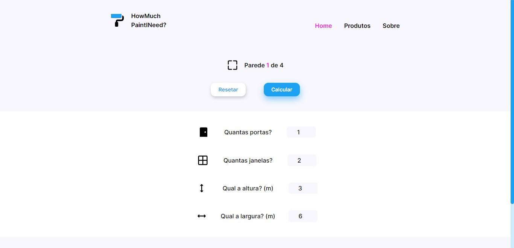

<!-- -->
<div align="center">

</div>

# 🎨 Paint Calculator - React & Tailwind CSS

<p>Projeto desenvolvido por: <strong>Thiago Silva Lopes</strong>, em 06/2022.<br/>
Para o code challenge da vaga de Front End Jr, da Digital Republic.</p>

### Demo: https://paintcalc-digitalrep.vercel.app

<p> Instalar o projeto localmente, com a pasta "node_modules": </p>

```
yarn install
```

<p> Compilar/executar o projeto: </p>

```
yarn dev
```

<small>© Thiago Silva Lopes </small>
